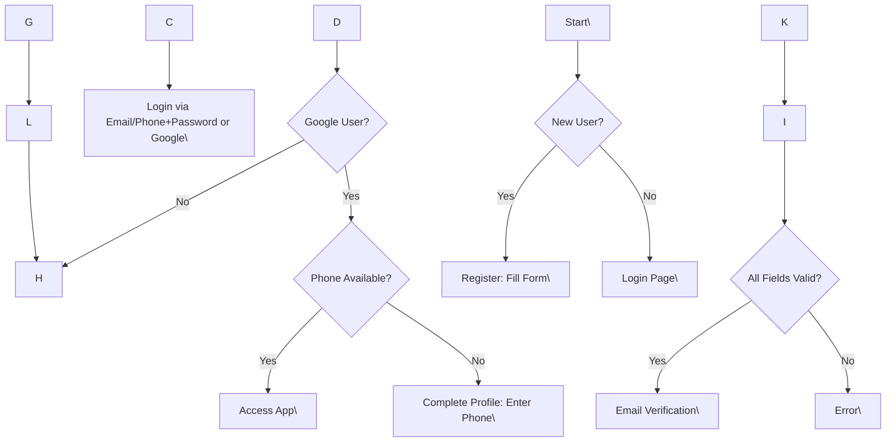
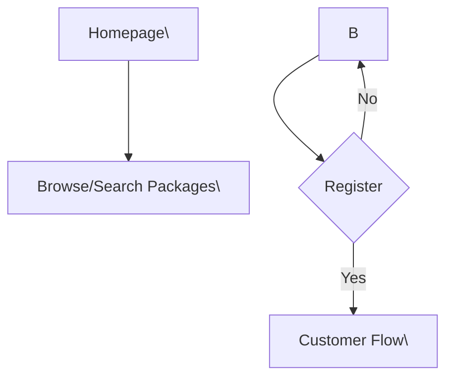
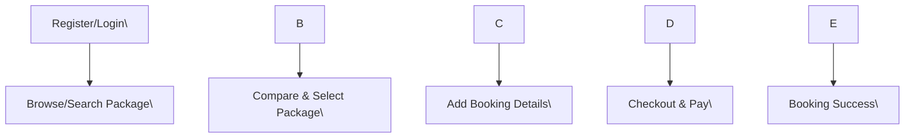
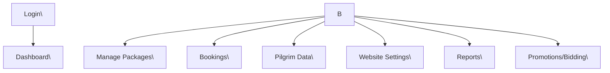
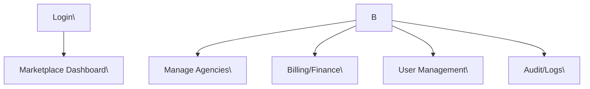
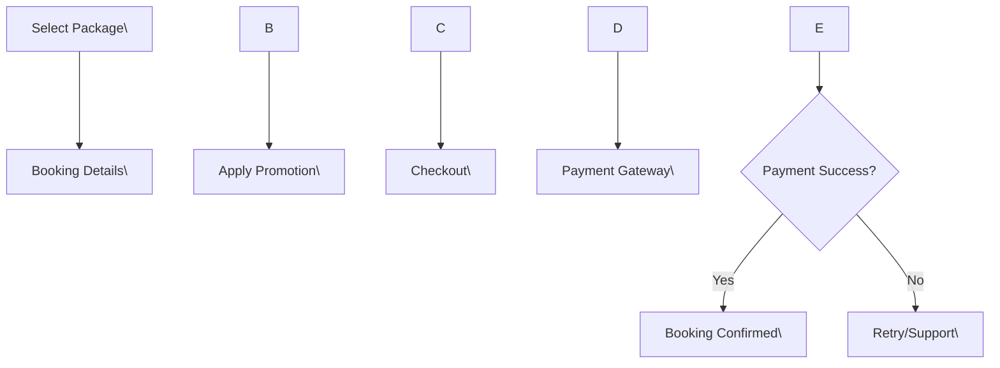

# UmrohQ Marketplace Platform PRD

### TL;DR

UmrohQ is an enterprise-grade, multi-tenant SaaS marketplace that empowers Umrah travel agencies to operate independent, fully branded websites while participating in a centralized marketplace. The platform’s revenue model is SaaS-based, charging onboarding, service, and promotional bidding fees. Designed for extensibility (future Hajj support), UmrohQ is engineered for scale, security, usability, and high configurability—serving agencies, pilgrims, and platform administrators alike.

---

## Goals

### Business Goals

* Launch a scalable multi-tenant marketplace for Indonesian Umrah travel agencies.
* Enable each agency to operate branded storefronts under both subdomains and custom domains.
* Generate predictable SaaS revenue from setup fees, service fees, and promotional bidding.
* Enable agencies to self-manage packages, branding, and digital presence.
* Deliver a production-grade, regulatory-compliant marketplace.

### User Goals

* Allow pilgrims to easily search, compare, and book Umrah packages online.
* Enable agency staff to manage packages, bookings, pilgrim data, and promotions intuitively.
* Facilitate quick onboarding and website customization for agencies.
* Provide transparent, secure transaction and booking flows for all users.
* Support responsive, mobile-first experiences for senior and mid-age user segments.

### Non-Goals

* Acting as a travel agency or fulfilling Umrah/Hajj travel operations.
* Supporting non-Umrah travel categories in the initial release.
* Manual billing/payment processing (all key flows should be digitalized).

---

## User Stories

### Personas & Key Stories

Guest

* As a Guest, I want to browse packages and compare travels, so I can make informed choices before registering.

Customer (Pilgrim)

* As a Customer, I want to register easily, so I can start booking Umrah packages.
* As a Customer, I want to search and filter packages, so I quickly find the best option.
* As a Customer, I want to review my booking status, so I always know my travel progress.
* As a Customer, I want to securely pay online, so my booking is confirmed instantly.
* As a Customer, I want to leave reviews, so I help others make decisions.

Travel Staff

* As Travel Staff, I want to manage packages, so our offerings are up to date.
* As Travel Staff, I want to manage bookings, so I can ensure smooth pilgrim journeys.
* As Travel Staff, I want easy reporting, so I can monitor our agency’s performance.

Travel Admin

* As Travel Admin, I want to configure our website and branding, so our digital presence is professional.
* As Travel Admin, I want to manage agency staff, so the right people have appropriate access.

Marketplace Admin

* As Marketplace Admin, I want to manage agencies, so I can maintain platform quality.
* As Marketplace Admin, I want to configure fees, promotions, templates, and review analytics, so the business model is supported.
* As Marketplace Admin, I want to access audit logs, so I ensure compliance.

Marketplace Billing

* As Marketplace Billing, I want to review fee payments, reconcile finance, and manage platform billing, so the business runs smoothly.

Super Admin

* As Super Admin, I want to manage platform settings, roles, security, and system configurations without restrictions.

Support

* As Support, I want access to user/bookings info (with privacy controls), so I can assist users efficiently.

---

## Role Permission Matrix

| Module | Guest | Customer | Travel Staff | Travel Admin | Marketplace Support | Marketplace Billing | Marketplace Admin | Super Admin |
| --- | --- | --- | --- | --- | --- | --- | --- | --- |
| Registration | View | Full | N/A | N/A | View | View | View | Full |
| Login | X | X | X | X | X | X | X | X |
| Package Search/View | Full | Full | Full | Full | Full | Full | Full | Full |
| Booking | \- | Full | Manage Own | Manage All | View | View | View | Full |
| Payment | \- | Own | View | View | View | View | View | Full |
| Agency Dashboard | \- | \- | Own | Full | View | View | View | Full |
| Marketplace Dashboard | \- | \- | \- | \- | Limited | Full | Full | Full |
| User Management | \- | Own | Manage Own | Full | View | View | Full | Full |
| Reports | \- | Limited | Own | Full | Full | Full | Full | Full |
| Promotion Mgmt | \- | \- | Propose | Approve | View | View | Manage | Full |
| Billing/Finance | \- | Own | View | View | View | Full | Full | Full |
| Settings | \- | Update | Update | Full | View | View | Full | Full |
| System Config | \- | \- | \- | \- | \- | \- | \- | Full |

---

## Authentication Requirements

### Registration

* User must provide: Full Name, Phone Number (mandatory, unique), Email (unique), Password, Password Confirmation.
* On success: Send verification email, verify phone for future scope.

### Login

* Allow login via Email or Phone Number + Password.
* Limit failed login attempts to prevent brute-force.

### Google Authentication (OAuth via Supabase)

* Allow Google Login/Sign-up.
* Require phone number on first login if missing; redirect Google users to complete profile page before granting access.

### Forgot & Reset Password

* Allow requesting password reset via email or phone.
* Send OTP/email link with secure token.

### Email Verification

* Required for all new users.

Edge Cases

* Register with duplicate email/phone ⇒ fail gracefully, show error.
* Google login with missing phone ⇒ require prompt and redirect.
* Password mismatches ⇒ clear warning.
* Invalid email or phone ⇒ inline validation.

Flow Diagram



---

## Marketplace Features

### Package Search

* Allow search by keyword, destination, departure date, price, duration, facilities, travel agency, airline, hotel, status.
* Real-time suggestions, instant results.

### Smart Filters

* Filter by: price range, duration, hotel stars, airline, availability, promotions, ratings, agency, departure city.
* Clear all filters option.

### Package Comparison

* Multi-package comparison. Side-by-side by all attributes (dates, pricing, hotel, facilities, policies, etc).
* Max 3 packages at once.
* Sticky comparison panel for ease of navigation.

### Travel Comparison

* Compare travel agencies on rating, service fee, total packages, review count, branding.

### Package Details

* Full details. Tabs: Overview, Itinerary, Facilities, Gallery, Terms, Cancellation Policy, Reviews.

### Travel Details

* Agency overview, branding, rating, active packages, customer reviews, direct contact options.

### Checkout

* Add passenger data, review total, apply promotion, payment summary, consent to terms.

### Online Payment

* Integrates with Indonesian payment gateways (recommendation: Midtrans/Xendit, configurable module).
* Support for credit/debit cards, bank transfer, e-wallets (OVO, DANA, GoPay), VA.
* Redirect and callback supported. Show payment instructions & status.

### Booking Status

* Booking timeline: Pending – Awaiting Payment – Paid – Confirmed – Cancelled – Refunded.

### Wishlist

* Save packages to wishlist. Persistent across sessions/logins.

### Reviews

* Post reviews for packages/travels after booking completion.
* Star+comment. Moderation workflow for marketplace admin.

### FAQ

* Dynamic, editable per agency + marketplace-wide.

### Articles

* Marketplace and travel blogs. SEO optimized. Category, tags, search, comments (moderated).

### Promotions

* Time-based, code-based, or channel-based discounting. Visible tags in UI.

---

## Travel Website Features

* Homepage: Agency-branded, top packages, testimonials, agency intro, CTAs.
* About: Company background, mission, vision, values.
* Packages: List + filter all agency-owned packages, primary CTA to booking.
* Testimonials: Rotating customer stories, with moderation.
* Gallery: Travel photos, agency moments. Uploaded via dashboard.
* Contact: Form + WhatsApp link, agency location/map.
* Blog: Agency-managed articles, SEO ready.
* FAQ: Agency-specific dynamic FAQ.
* Custom Pages: Up to 5 custom CMS pages.
* Branding: Logo, favicon, colors, typography.
* Theme Config: Pre-set & custom color schemes, layout templates, dark/light mode.
* SEO Setting: Meta title, desc, sitemap.xml, Google Analytics integration.

---

## Travel Dashboard Requirements

* Company Profile: Manage agency data, logo, legal docs, team.
* Package Management: CRUD, duplicate, publish, archive, per attribute.
* Booking Management: List/search all bookings, manage statuses, refunds, filter by pilgrim, package.
* Pilgrim Management: CRUD, link to bookings, export CSV.
* Website Settings: Branding, templates, custom domain setup (via DNS/CNAME or recommended DNS provider).
* Reports: Bookings, revenue, occupancy rates, commissions, downloadable.
* Promotion Mgmt: Create/view promotions for own packages.
* Bidding Mgmt: Manage search result bids, see analytics per bid.

---

## UmrohQ Marketplace Dashboard Requirements

* Travel Management: Approve/disable agencies, view metrics, impersonate, manage billing.
* User Management: CRUD, reset password, role assignment across all roles.
* Billing: Invoice management (setup/service/promotional), manual and automated reconciliation.
* Finance: Platform-wide revenue, payout management.
* Setup Fee: Config table, by agency, exportable.
* Service Fee: Config per channel, discounting.
* Promotions: Create/manage platform-wide and agency-specific.
* Discounts: Bulk/seasonal/targeted logic.
* Website Templates: CRUD templates, assign default for new agencies.
* CMS: Manage marketplace blog, articles, FAQ.
* Analytics: Traffic, conversion, search analytics, top packages/agencies.
* Audit Logs: Full activity history (who/when/what changes).
* System Config: Fees, auth settings, theme presets, email templates, integration keys.

---

## Billing Requirements

* Setup Fee: Configurable per agency, invoice on-boarding (one-time).
* Service Fee: Auto-calculate per-pilgrim for bookings, per channel config.
* Invoice: Fully itemized, downloadable PDF, secure link sharing.
* Payment Reconciliation: Automated (payment gateway) + manual override.
* Refund: Partial/full, with reason codes, requires admin approval.
* Discounts: Stackable rules, approval flow, time-limited.
* Promotions: Linked to campaigns, audit tracking.
* Financial Reports: Breakdown by agency, date, revenue source, file export (CSV/XLS).

---

## Package Management + Validation Rules

* Package Name: Required, unique within agency, max 100 chars.
* Slug: Auto-generated, deduplicated, editable.
* Description: Required, min 30 chars, supports rich text.
* Price: Required, ≥0, currency in IDR, decimal precision.
* Discount: Optional, ≤price, percentage or nominal.
* Quota: Required, integer ≥1.
* Departure Date: Required, ≥today.
* Duration: Required, integer 1-30.
* Departure City, Hotel, Airline: Required, selected from static or dynamic lists.
* Facilities, Visa, Tour Guide, Gallery: Optional, list.
* Terms: Required, editable text.
* Cancellation Policy: Required, text/rich text.
* Status: Draft, Published, Archived.

---

## Search System Documentation

### Search Flow

* Input (query, filters) → Process → Ranking → Results → Optional Sponsored.

### Ranking Logic

* Default: Relevance x Availability x Ratings x Recency.
* Sponsored: Bids ranked first (if tied, sort by bid time and random).

### Sponsored Listings & Bidding Priority

* Agencies enter bid per package/day. Highest bid = top.
* Sponsored flag visibly shown in UI.

### Sorting

* Price (asc/desc), duration, rating, popularity.

### Filtering

* All core attributes (date, city, agency, price, availability, hotel stars, promotion, etc).

### Recommendation Strategy

* Hybrid: Recent trends, best-sellers, personalization (logged-in)
* Industry Recommendation: Use collaborative filtering & trending logic for cross-selling.

### SEO

* SSR, structured schema (JSON-LD)
* SEO-friendly URLs (agency, package, blog)
* Dynamic sitemap per tenant.
* Index control per package/page.

---

## Conceptual Database Documentation

### Entities (abbreviated)

* User: id, name, email, phone, password, role, status, timestamps.
* Agency: id, name, slug, branding, setup info, legal docs, status.
* Package: id, agency_id, ... (see above package keys).
* Booking: id, customer_id, package_id, status, pay_status, total, details.
* Pilgrim: id, full_name, passport_no, linked to booking.
* Promotion: id, code, type, discount_amount, valid_from/until.
* Payment: id, booking_id, status, amount, channel.
* Invoice: id, agency_id, amount, due_date, status.
* Review: id, package_id or agency_id, user_id, rating, comment, status.
* Wishlist: id, user_id, package_id.
* Bid: id, package_id, agency_id, amount, valid_until.
* CMS/Article/Faq: id, agency/marketplace scope, title, content.
* Audit Log: id, user_id, action, entity, timestamp.
* SystemConfig: id, key, value, description.

### Relationships

* User–Agency (1:M, role-based assignment).
* Agency–Package (1:M).
* Booking–Pilgrim (1:M).
* Booking–Package (M:1).
* Booking–Payment (1:M).
* Agency–Invoice (1:M).
* Package–Bid (1:M).
* User–Review (1:M).

### ERD (Description only)

* Users link to Agencies via roles. Agencies own packages, each package is booked by one or more bookings. Bookings are paid, relate to multiple pilgrims, each booking tied to a customer. Invoices tie to agency transactions.

### Keys & Constraints

* All PKs UUID. Email/phone unique. FKs with CASCADE/SET NULL as needed. All tables have created_at, updated_at, deleted_at (soft delete).

### Index Strategy

* PKs, FKs, search-critical fields (package name, slug, agency).

### Soft Delete & Audit Tables

* deleted_at field for all business tables (soft delete strategy).
* Audit Log for all create/update/delete events.

---

## API Modules

* Authentication
* Users
* Travel (agency CRUD, branding, domain)
* Packages
* Bookings
* Payments
* Billing
* Website Builder (tenant themes, templates)
* CMS
* Analytics
* Reports
* Notifications
* Configuration
* Audit Logs

---

## Page Structure (Sitemap)

### Marketplace

* / (Home)
* /search
* /package/\[slug\]
* /travel/\[slug\]
* /compare
* /articles
* /faq
* /promotions
* /login
* /register

### Authentication

* /login
* /register
* /forgot-password
* /reset-password
* /verify-email
* /oauth/callback

### Travel Website

* / (Home)
* /about
* /packages
* /testimonials
* /gallery
* /contact
* /blog
* /faq
* /custom/\[page\]

### Customer Dashboard

* /dashboard
* /dashboard/bookings
* /dashboard/wishlist
* /dashboard/settings

### Travel Dashboard

* /dashboard
* /dashboard/packages
* /dashboard/bookings
* /dashboard/pilgrims
* /dashboard/reports
* /dashboard/website
* /dashboard/promotions
* /dashboard/bidding
* /dashboard/settings

### Marketplace Dashboard (Admin, Billing, Support)

* /admin/travels
* /admin/users
* /admin/billing
* /admin/finance
* /admin/setups
* /admin/service-fees
* /admin/promotions
* /admin/discounts
* /admin/templates
* /admin/cms
* /admin/analytics
* /admin/audit-logs
* /admin/settings

### System Pages

* /404
* /500
* /maintenance

### Legal Pages

* /terms
* /privacy
* /cookies

### Error Pages

* 404, 403, 500, 422 (as per system)

---

## User Flow Diagrams

Guest Navigation



Customer Registration/Booking



Travel Admin Dashboard



Support/Billing/Admin



Google Login Flow

```mermaid
graph TD
    A\[Google OAuth Login\] --> B{Phone Number Exists?}
    B -- No --> C\[Prompt: Complete Profile (Phone)\]
    C --> D\[Save Profile\]
    D --> E\[Access App\]
    B -- Yes --> E

```

Booking/Checkout/Payment



---

## Functional Requirements & Acceptance Criteria

### Authentication

* Register/Login/Google/Forgot/Reset/Verify: Forms validate required fields, username unique, error handling, secure password.
* Acceptance: Register fails on duplicate; password reset invalid link expires; Google missing phone triggers mandatory prompt.

### Marketplace

* Search: Fast, robust, accurate per filters.
* Compare: Package/Travel side-by-side, max 3, sticky panel present.
* Booking: Only logged-in, full passenger data, prevents over-booking.
* Payment: Gateway integration, status tracked, payer matched.
* Promotions: Only valid/active discounts applied.

### Dashboard (Travel)

* Company/Profile: Only agency admin can update.
* Package: CRUD, status transitions, validation, draft/publish/archive status flow.
* Bookings: View, update status, process refund with audit/tracking.
* Pilgrim: Linked to bookings, can be exported.
* Reports: Export tables.
* Bidding: Only for agency's live packages, bid logic enforced.
* Acceptance: Any update/modification is logged.

### Marketplace Admin

* User/agencies: CRUD, change status, reset passwords.
* Billing/Finance: Invoices, manual/auto reconciliation, refunds.
* System Config: Only super admin can change critical settings.
* Audit Log: Immutable entry for every significant admin action.

---

## Non-Functional Requirements

* Performance: ≤1s average page load time, scalable to 1M+ MAU.
* Security: OWASP compliance, RBAC, 2FA (recommended), encrypted sensitive fields, logging.
* Scalability: Multi-tenant isolation, horizontal scaling, stateless where possible.
* Availability: 99.9% uptime, global CDN, HA database.
* Accessibility: WCAG 2.1 AA, screen reader support, high contrast, keyboard navigable.
* SEO: Structured schema, sitemap, robots.txt, indexable pages, per-tenant settings.
* Logging: Centralized, redact PII, role-based access.
* Monitoring: Real time health, usage metrics, error reporting (recommend Sentry/Datadog or similar).
* Backup & DR: Nightly DB backup, rapid restore, redundancy.
* Localization: Bahasa Indonesia, English; auto-locale by browser; i18n-ready.

---

## UI/UX Requirements

* Modern, premium, professional aesthetic.
* Minimal, Islamic, trustworthy; avoid overlapping/garish colors.
* Senior-friendly: large targets, font, clear contrast, readable at scale.
* Responsive/mobile-first for all workflows.
* All forms accessible, error messages clear.
* Shadcn/UI design best practices: dark/light mode, accessible dialog components, skeletons, states, spacing.
* Iconography to reinforce key actions (book, pay, review, support).

---

## Design System Specification

### Typography

* Headings: Inter, 700, 1.5-2.5em
* Body: Inter, 400, 1em
* Minimum readable font size: 16px

### Color Tokens (proposed)

| Token | Example Value | Usage |
| --- | --- | --- |
| primary | #2EA56F | CTA, buttons |
| secondary | #00695C | Secondary buttons |
| accent | #FFD700 | Highlight, badges |
| error | #D32F2F | Error/alerts |
| warning | #FFA000 | Warnings |
| info | #1976D2 | Info, links |
| bg | #FFFFFF | Primary background |
| surface | #F5F9F8 | Card/secondary bg |
| divider | #E0E0E0 | Borders |

### Spacing

* 4/8/12/16/20/24/32 px systemized scale

### Border Radius

* Small: 4px
* Medium: 8px (default)
* Large: 20px (promo banners, overlays)

### Components

* Buttons: Shadcn/Button, primary/secondary/ghost.
* Inputs: Large field, clear error/placeholder, focus state.
* Cards: Shadow-2, elevation on hover.
* Tables: Striped, sortable headers, responsive.
* Dialogs: Modal, confirm dialog, slide out drawer.
* Badges: Rounded, small, color-tokens.
* Alerts: Inline, dismissible, accessible icons.
* Toast: Shadcn Toast, for ephemeral messages.
* Loading: Spinners, skeleton screens, async loader.
* Skeleton: Placeholder for loading data/cards.
* Empty State: Icon/illustration, clear CTA.
* Icons: Lucide/Feather for clarity & consistency; theme-matching.

---

## Recommendation

For payment gateway: Integrate with an Indonesian provider (Midtrans/Xendit). Add OTP-enabled 2FA for admin and billing-critical actions for increased platform security. For analytics, integrate with a privacy-compliant solution (e.g., Plausible/GA4). For DNS setup, offer a step-by-step wizard with CNAME validation via a recommended DNS provider to simplify onboarding.

---

## End of Document

This PRD is intended to be comprehensive and will serve as the primary reference source for all future product, design, development, QA, DevOps, and stakeholder activities. Any missing areas should default to industry best practices until explicitly amended in later stages.